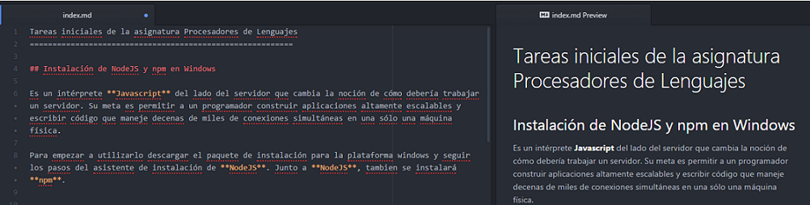
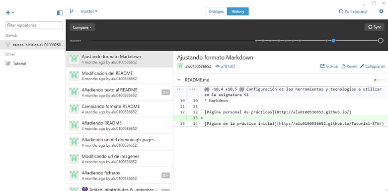

Tareas iniciales de la asignatura Procesadores de Lenguajes
==========================================================

## Instalación de NodeJS y npm en Windows

Es un intérprete **Javascript** del lado del servidor que cambia la noción de cómo debería trabajar un servidor. Su meta es permitir a un programador construir aplicaciones altamente escalables y escribir código que maneje decenas de miles de conexiones simultáneas en una sólo una máquina física.

Para empezar a utilizarlo descargar el paquete de instalación para la plataforma windows y seguir los pasos del asistente de instalación de **NodeJS**. Junto a **NodeJS**, tambien se instalará **npm**.


Abrimos la consola de **NodeJS** y la de windows, de esta forma comprobamos que tando **NodeJS** como **npm** se ha instalado correctamente probando algunos comandos como los siguientes:

> `node -v`

> `npm -v`


> `.help`


Instalamos el framework **Express** con la consola de **NodeJS** y el siguiente comando:

**Comando**

> `npm install express`


## Instalación del editor de texto Atom

Usaremos **Atom** como editor de texto para el desarrollo de nuestros proyectos, para ello descargamos el instalador en la página oficial de atom, y a continuación ejecutamos el asistente de instalación. Al abrir una proyecto podremos ver la sencillez del editor


Dado que vamos a utilizar el formato **Markdown** es bueno saber que en **Atom** podremos obtener una preview del contenido de nuestro fichero Markdown ya que incorpora el formato **GitHub Markdown** con el comando:



**Comando**

> * Markdown preview `ctrl+shift+m`
> * Markdown export to HTML `Save As HTML`


## Instalación de GitHub Desktop

GitHub es una plataforma para alojar proyectos utilizando el sistema de control de versiones **Git**. Para instalarlo accedemos a la página oficial de **GitHub** y descargamos el instalador que ejecutaremos posteriormente para iniciar el asistente de instalación.


Una vez instalado configuramos nuestra cuenta de **GitHub** en la aplicación para poder sincronizar nuestro repositorio tanto local como remoto, en caso de no tener cuenta crearemos una en la página de **GitHub**. Al cargar un proyecto podremos ver el historial de su desarrollo.



Además,junto con la instalación de **GitHub** podremos tener una consola llamada **Git Shell** con la que podremos utilizar comandos propios de git.


## Cloud 9

Es un IDE de desarrollo online, para su uso será necesario crear una cuenta en la página oficial o acceder con las credenciales de GitHub si ya se dispone de una cuenta. Una vez registrados podremos crear proyectos de varias tecnologías como puede ser NodeJS, HTML5, C++, Ruby On Rails, etc.


Si disponemos de algún proyecto en un repositorio de GitHub podremos asociarlo a **Cloud9** para trabajar en él tan solo creando un “`nuevo workspace`” y añadiendo la url *git* del correspondiente repositorio o en el mismo **Cloud9** podemos ver los repositorios conectados y clonarlos.


Para poder ver los repositorios en **Cloud9** habrá que vincularla con la cuenta de **GitHub**.


Además **Cloud9** permite el trabajo en equipo en el IDE añadiendo miembros a tu workspace.

## Markdown

Markdown es un lenguaje de marcado ligero, lo vamos a utilizar en el editor de texto Atom ya que incorpora por defecto este formato y podremos obtener un live preview mientras vamos desarrollando además de poder exportarlo a HTML sin la necesidad de usar un conversor adicional.

Sintaxis:


Encabezados
```
# Encabezado H1
## Encabezado H2
### Encabezado H3

ESTO ES UN H1
=============
ESTO ES UN H2
-------------
```

Tipografía
```
**Negrita**
*Cursiva*
> Citas
Parrafo separar por lineas en blanco
`Codigo`
~~Tachado~~
```
Recursos
```

* [Links](https://example.com)
```

Listas
```
1. Lista 1
2. Lista 2

* Lista 1
* Lista 2

+ Lista 1
+ Lista 2

- Lista 1
- Lista 2
```

Tablas
```
Col.1     |    Col.2
----------|-----------
Contenido | Contenido
```

## Instalación de Pandoc
**Pandoc** es un software gratuito de código abierto que nos permitirá la tradución de archivos en formato **Markdown** a **HTML**, aunque su potencia va mucho más alla. Para su instalación no hace falta más que ir a su página oficial y seguir las instruccion para descargarlo e instalarlo.

Como **Pandoc** no tiene una interfáz gráfica, para utilizarlo tendremos que abrir una consola, donde primero comprobaremos que se ha instalado correctamente con el siguiente comando

> `pandoc --version`


Para convertir un fichero **Markdown** a **HTML** tendremos que estar en el directorio del fichero para ejecutar el comando que generará el archivo nuevo.

> `pandoc index.md  -f markdown  -t html -s -o index.html`


**Recursos:**

* [NodeJS](https://nodejs.org)
* [Express](http://expressjs.com)
* [Atom IDE](https://atom.io)
* [GitHub Desktop](https://desktop.github.com)
* [GitHub Pages](https://pages.github.com/)
* [Cloud 9 IDE](https://c9.io)
* [Markdown](http://daringfireball.net/projects/markdown/)
* [Pandoc](http://pandoc.org/)
* [Resultado del Markdown HTML](http://alu0100536652.github.io/Tutorial-STW/)
